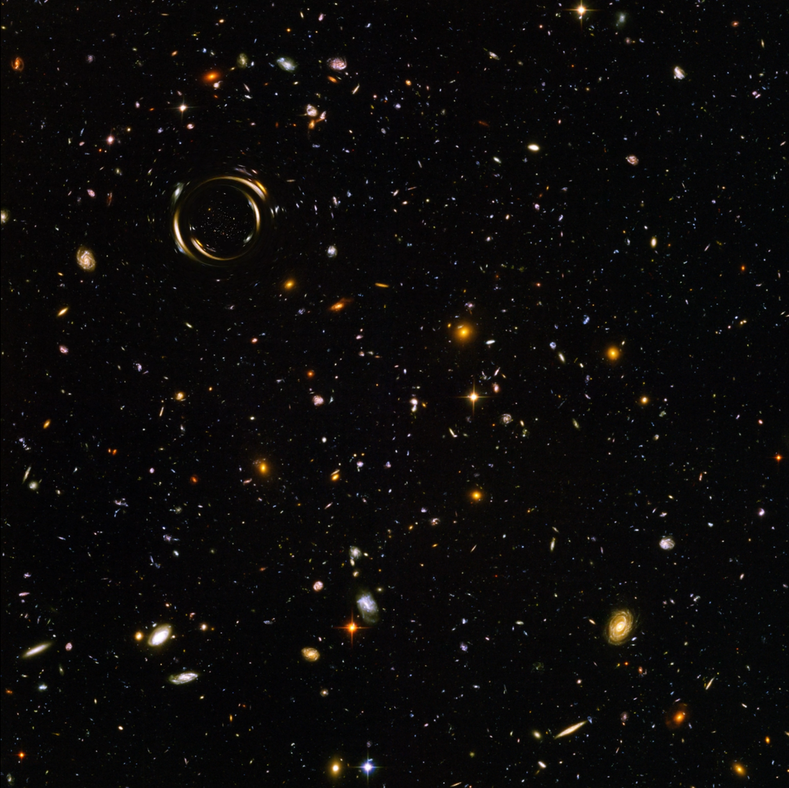

# Gravitational Lensing Simulation

A physically-based simulation of a black hole passing diagonally in front of a background galaxy field (e.g. the Hubble Deep Field), producing gravitational lensing effects including tangential streaking, Einstein ring formation, and a de-magnified secondary image inside the ring.



---

## Physics

The simulation implements the **weak-field, far-source approximation** from General Relativity. This is valid when the lens distance $D_l$ is much larger than the Schwarzschild radius $r_s = 2GM/c^2$ — i.e. for any realistic astrophysical observation.

### Deflection angle

The GR deflection of a light ray passing a point mass $M$ at impact parameter $\xi$ is:

$$\hat{\alpha} = \frac{4GM}{c^2 \xi}$$

This is the full GR result (twice the Newtonian prediction), confirmed by Eddington in 1919.

### Einstein radius

For a lens at distance $D_l$ and source at $D_s$, the Einstein radius is:

$$\theta_E = \sqrt{\frac{4GM}{c^2} \frac{D_{ls}}{D_l D_s}}$$

In the far-source limit ($D_{ls} \approx D_s$) this simplifies to $\theta_E \approx \sqrt{4GM / (c^2 D_l)}$.

### Lens equation

The mapping from image position $\theta$ to source position $\beta$ is:

$$\vec{\beta} = \vec{\theta} - \theta_E^2 \frac{\vec{\theta} - \vec{\theta}_L}{|\vec{\theta} - \vec{\theta}_L|^2}$$

This quadratic equation has **two solutions** for any source position:

$$\theta_{\pm} = \frac{1}{2}\left(\beta \pm \sqrt{\beta^2 + 4\theta_E^2}\right)$$

- $\theta_+$ — **primary image**: outside the Einstein ring, same side as the source
- $\theta_-$ — **secondary image**: inside the Einstein ring, opposite side, de-magnified and parity-flipped

### Rendering

Each output pixel is inverse-raytraced to its source-plane position and the background image is sampled there (bilinear interpolation). Both images emerge from the same formula with no special casing — the math produces them naturally.

### Singularity guard

The Schwarzschild radius in pixel units is derived (not hardcoded) as:

$$r_{s,\text{px}} = \frac{\theta_{E,\text{px}}^2}{2 \, D_{l,\text{px}}}$$

A feathered mask of this radius is applied at the lens centre to avoid the numerical divergence at $r = 0$. For typical parameters this is sub-pixel and invisible.

### Validity

The weak-field thin-lens equations break down when $D_l \lesssim r_s / 2$, i.e. when the black hole is extremely close to the observer. Simulating a black hole approaching the camera requires full null geodesic integration through the Schwarzschild metric — a fundamentally different (and significantly harder) problem.

---

## Requirements

- Python 3.8+
- numpy
- matplotlib
- scipy
- Pillow
- ffmpeg (must be installed and on your `PATH`)

Install Python dependencies:

```bash
pip install numpy matplotlib scipy Pillow
```

Install ffmpeg:

```bash
# Ubuntu / Debian / WSL
sudo apt install ffmpeg

# macOS
brew install ffmpeg

# Anaconda (any platform)
conda install -c conda-forge ffmpeg
```

---

## Usage

```bash
python gravitational_lensing.py --image hubble.jpg
```

```bash
python gravitational_lensing.py --image hubble.jpg \
    --output lensing.mp4 \
    --frames 120 \
    --fps 24 \
    --einstein_radius 80 \
    --D_l 1e6 \
    --scale 1.0
```

### Arguments

| Argument | Default | Description |
|---|---|---|
| `--image` | *(required)* | Path to background galaxy/nebula image |
| `--output` | `lensing.mp4` | Output video filename |
| `--frames` | `120` | Total number of frames |
| `--fps` | `24` | Frames per second |
| `--einstein_radius` | `80` | Einstein ring radius in pixels |
| `--D_l` | `1e6` | Distance to lens in pixels (same angular units as `einstein_radius`). Controls the Schwarzschild guard radius via $r_s = \theta_E^2 / (2 D_l)$ |
| `--scale` | `1.0` | Resize background by this factor before rendering. Use `0.25`–`0.5` for faster test renders on large images |

### Performance note

Render time scales with the number of pixels in the background image. For a 6200×6200 image, use `--scale 0.25` or `--scale 0.5` for test runs. The progress output printing `frame 1/N` multiple times at the start is expected — matplotlib calls the update function several times during writer initialisation before saving begins.

---

## Background image

Any astronomy image works. Good sources:

- [Hubble Legacy Archive](https://hla.stsci.edu/)
- [ESA/Hubble](https://esahubble.org/images/)
- [NASA Image Gallery](https://images.nasa.gov/)

The Hubble Ultra Deep Field or any deep field image with many background galaxies gives the most visually striking result.

---

## What you will see

- **Tangential streaking** of background galaxies as the lens approaches
- **Einstein ring** forming at closest alignment — a complete ring when the source, lens, and observer are collinear
- **Secondary image** — a faint, de-magnified, parity-flipped copy of the background visible inside the Einstein ring throughout the transit
- **Magnification spike** at closest approach

---

## Limitations

- Point-mass (Schwarzschild) lens only — no spin (Kerr), no extended mass distribution
- Thin-lens / weak-field approximation — invalid for $D_l \lesssim r_s$
- No relativistic beaming, accretion disk, or Doppler effects
- Single lens plane — no multi-plane lensing
